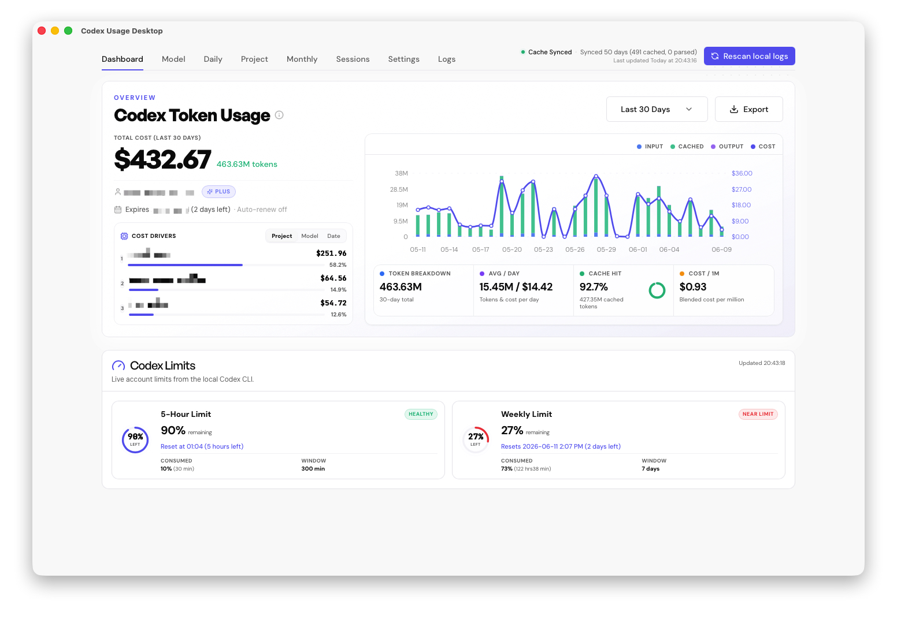

# Codex Usage Desktop


[](https://github.com/itvincent-git/codex-usage-desktop/releases/latest)
[](LICENSE)
[](https://github.com/itvincent-git/codex-usage-desktop/releases/latest)
[](https://tauri.app/)
[](#privacy)

> See where your Codex tokens and dollars go — locally.

A local-first macOS dashboard for OpenAI Codex CLI usage.
No cloud account. No API key. No log upload. Reads your local ~/.codex logs.

[Download the latest release](https://github.com/itvincent-git/codex-usage-desktop/releases/latest) · [中文 README](README_zh.md)

## Why this exists

Codex usage can grow quickly, but tracking it shouldn't cost you your privacy or credentials security. 

Unlike traditional analytics platforms that require cloud logins and API key uploads, **Codex Usage Desktop** is built with a local-first philosophy.

### 📊 Local-First vs. Cloud SaaS Analytics

| Feature                  | Codex Usage Desktop (Local-First)                         | Traditional Cloud SaaS                             |
|:------------------------ |:--------------------------------------------------------- |:-------------------------------------------------- |
| **Data Privacy**         | 🟢 **100% Local**. Your logs never leave your machine.    | 🔴 Uploads logs to third-party cloud servers.      |
| **Credentials Security** | 🟢 **Zero API Keys required**. No keys are stored.        | 🔴 Requires uploading master API keys/tokens.      |
| **Costs**                | 🟢 **Free & Open Source**. No subscription.               | 🔴 Pay-per-seat subscription models.               |
| **Performance**          | 🟢 **Blazing fast SQLite**. Local TUI/JSONL log indexing. | 🔴 Subject to network latency and API rate limits. |

---

## Features

* 🔍 **Local-First Log Scanner**: Automatically parses Codex CLI session logs (`~/.codex/sessions`) on your machine in real-time. No cloud API keys or accounts required.
* 📊 **Interactive Dashboard**:
  * **Multiple Windows**: Filter metrics over different timeframes (1d, 7d, 14d, 30d, 60d, 90d).
  * **Aggregated Trends**: Real-time charts for input/output tokens, cached tokens, and daily cost estimates.
* 💼 **Granular Breakdown**:
  * **Project Analysis**: Track which project directories or repositories are consuming the most tokens.
  * **Model Cost Estimates**: Segment usage by models (e.g., `gpt-4o`, `gpt-3.5-turbo`) to see where your budget goes.
* 🗓️ **Natural Month Overview**: Track aggregate monthly spending and token budgets for long-term project planning.
* 💾 **Flexible Data Export**: One-click export of current dashboard datasets to Excel (`.xlsx`) or Markdown (`.md`) reports.
* ⚙️ **Cache Management**: Instantly rebuild or purge the local SQLite usage index directly from settings to refresh data.

## Download And Install

Download the latest macOS build from [GitHub Releases](https://github.com/itvincent-git/codex-usage-desktop/releases/latest).

Current release builds:

- macOS Apple Silicon
- macOS Intel

Windows and Linux builds are planned, but the current release workflow only publishes macOS desktop packages.

## Privacy & Security

> [!IMPORTANT]
> **Zero Cloud Telemetry & Credentials Security Guarantee**
> 
> * **No API Keys Stored**: The app **does not require or store** your OpenAI/LiteLLM API keys. It parses local logs that already contain token counts.
> * **Logs Stay Local**: Source session files in `~/.codex` are read strictly on your device and are never uploaded, shared, or modified.
> * **Local-first SQLite Cache**: Summarized metrics are stored in a local SQLite cache in your system's app data directory.
> * **Minimal Network Activity**: Pricing data is cached locally. If missing, the app fetches public pricing lists from LiteLLM over HTTPS, without sending any user credentials or usage metrics.

## Advanced Options

- `CODEX_HOME`: Codex home directory, default `~/.codex`
- `CODEX_USAGE_TIMEZONE`: timezone for day bucketing, default system timezone with UTC fallback

## Current Limits

- The app shows daily and monthly aggregate usage, not session-level detail.
- Unknown models default to zero cost.
- Release packages are currently macOS-only.

## Roadmap

- Windows and Linux release packages.
- More detailed usage drilldowns.
- More export and reporting options.

## Development

The app is built with React 19, Vite, Tauri v2, and a native Rust usage pipeline.

Install Node.js `>= 24`, `pnpm`, Rust, and Tauri v2 system dependencies, then run:

```bash
pnpm install
pnpm dev:app
```

Useful checks:

```bash
pnpm test
pnpm typecheck
cd src-tauri && cargo test
```

Packaged builds use:

```bash
pnpm build
pnpm tauri build
```
