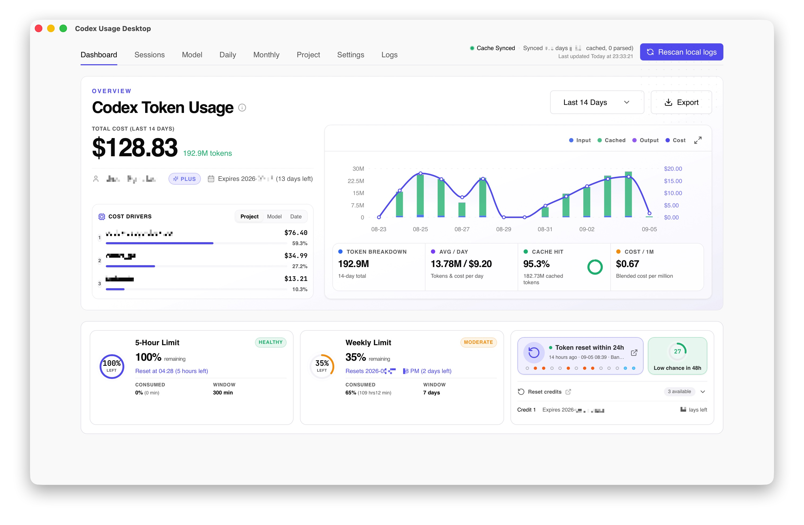
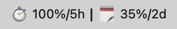
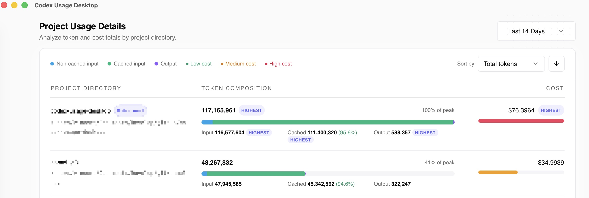
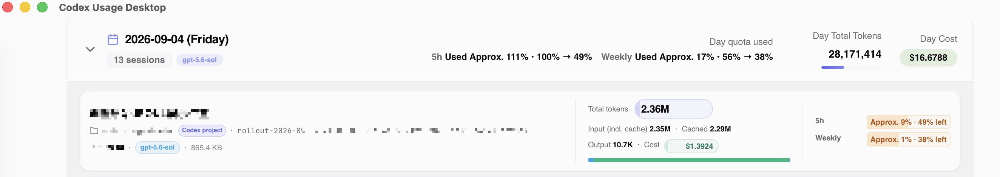
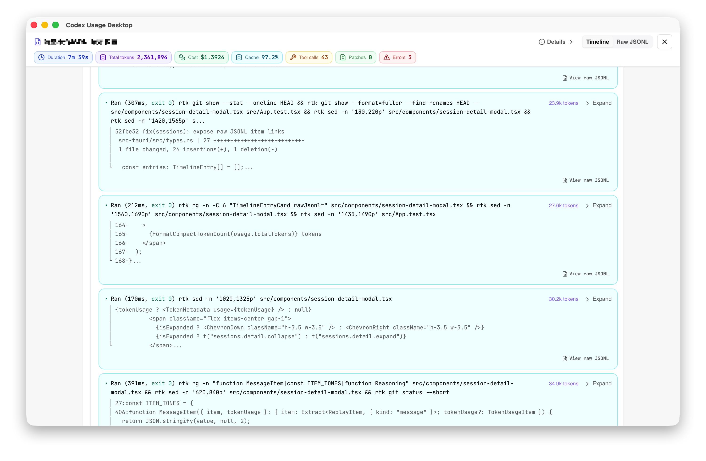

# Codex Usage Desktop

> **Know where your Codex tokens go, how much quota you have left, and when your limits reset — all from one local desktop app.**

**[Download for Windows x64](https://github.com/itvincent-git/codex-usage-desktop/releases/latest/download/codex-usage-desktop-windows-x64-setup.exe)** · **[Apple Silicon](https://github.com/itvincent-git/codex-usage-desktop/releases/latest/download/codex-usage-desktop-macos-arm64.dmg)** · **[Intel Mac](https://github.com/itvincent-git/codex-usage-desktop/releases/latest/download/codex-usage-desktop-macos-x64.dmg)** · [中文说明](README_zh.md) · [日本語](README_ja.md)

⭐ If Codex Usage Desktop is useful to you, consider giving the project a [**Star**](https://github.com/itvincent-git/codex-usage-desktop).

## Stop guessing where your Codex quota went

If you use Codex every day, you've probably wondered:

- **How much of my 5-hour or weekly limit is left?**
- **When will my quota reset?**
- **Which project or session used most of my tokens?**
- **How much did I use today compared with yesterday?**
- **Which models are consuming the most tokens and estimated cost?**
- **What exactly happened inside a long Codex session?**

Codex Usage Desktop answers those questions by turning the Codex session data already on your computer into a clear native dashboard.

**No API key. No separate account. No uploading your session logs. Just install and open.**



## What you can do

### 📊 See your Codex usage at a glance

Understand your usage without digging through JSONL logs.

View:

- Total tokens and estimated cost
- Input, output, and cached token usage
- Cache hit rate
- Daily and monthly trends
- Average daily usage
- Custom date ranges

Quickly see whether your Codex usage is increasing and where those tokens are going.

### ⏱ Know your limits before you hit them

Keep your current Codex quota visible while you work.

Monitor:

- Live **5-hour limits**
- **Weekly or monthly limits**
- Remaining quota
- Reset times and countdowns
- Available reset credits
- Quota-reset forecasts when available

You can also show limit information directly in the **macOS menu bar or Windows system tray**, with customizable text and countdown units, so you don't need to keep the dashboard open.

Live limits use your existing local Codex login.



### 🔍 Find what is using your tokens

Break usage down by:

- Project
- Model
- Day
- Month
- Session

See **which project, model, or session consumed your tokens** and understand what drives your usage.



### 💬 Understand individual Codex sessions

Go beyond aggregate charts and inspect the sessions behind the numbers.

Search sessions by title, project, and model, then open any session to inspect its activity.



Depending on what is recorded in the local logs, session views can show:

- Token and estimated cost usage
- Estimated 5-hour and weekly quota consumption
- Remaining quota changes
- Commands and tool activity
- Web searches and results
- Patch and diff activity
- Long-running commands
- Subagent hierarchy
- Session replay timeline

This makes it easier to understand both **what Codex did** and **how much usage that work consumed**.



### 🔄 Understand quota resets

Codex quota behavior can change over time. Codex Usage Desktop helps make those changes visible.

See:

- Latest official token-reset announcement
- Recent reset events
- 30-day reset announcement history
- Daily quota balance changes observed in session logs
- Reset-credit details and expiration times when available

### 💻 Built for daily desktop use

Codex Usage Desktop is designed to stay out of your way:

- Native macOS and Windows app
- macOS menu bar / Windows system tray
- Launch at login
- Automatic update checks
- English, 简体中文, and 日本語
- Windows WSL Codex session detection
- Light and dark themes

### 📤 Export your usage data

Need to analyze or share your usage elsewhere?

Export the selected dashboard range to:

- **Excel (`.xlsx`)**
- **Markdown (`.md`)**

## Private by default

Your Codex sessions can contain sensitive prompts, code, commands, and project information.

Codex Usage Desktop keeps that data on your computer.

- Session logs are **read locally**
- Session logs are **never uploaded by the app**
- No OpenAI or LiteLLM API key is required
- No Codex Usage Desktop account is required
- Aggregated statistics are stored in a local SQLite database
- The project is **free and open source**

Your Codex data stays yours. See [Privacy and network access](#privacy-and-network-access) for details on live limits and other network requests.

## Zero setup

Already using Codex CLI? Then you're ready to explore your usage.

1. Install Codex Usage Desktop.
2. Open it.
3. Your existing Codex sessions are detected and indexed automatically.
4. Start exploring your tokens, limits, projects, models, and sessions.

No analytics server to deploy. No database to configure. No API key to paste.

**Just install and use it.**

## Install

### Windows 10/11 x64

[Download the latest Windows setup executable](https://github.com/itvincent-git/codex-usage-desktop/releases/latest/download/codex-usage-desktop-windows-x64-setup.exe), open it, and follow the installer. The current-user NSIS installer does not require a system-wide installation.

> [!WARNING]
> The Windows installer is not Authenticode-signed yet, so Microsoft Defender SmartScreen may show an unrecognized-app warning. Verify that the file came from this repository's GitHub release before continuing.

The app first uses sessions under `%USERPROFILE%\.codex`. If that location has no JSONL sessions, it automatically checks the default WSL distribution and uses its `$HOME/.codex` data and Codex CLI. Native and WSL sessions are not combined, which prevents duplicate usage totals.

### macOS

Choose the build for your Mac:

| Mac                                       | Download                                                                                                                                           |
| ----------------------------------------- | -------------------------------------------------------------------------------------------------------------------------------------------------- |
| Apple Silicon (M1, M2, M3, M4, and newer) | [Download the latest ARM64 DMG](https://github.com/itvincent-git/codex-usage-desktop/releases/latest/download/codex-usage-desktop-macos-arm64.dmg) |
| Intel                                     | [Download the latest x64 DMG](https://github.com/itvincent-git/codex-usage-desktop/releases/latest/download/codex-usage-desktop-macos-x64.dmg)     |

Open the DMG and move **Codex Usage Desktop** to Applications. You can also browse the [latest release and release notes](https://github.com/itvincent-git/codex-usage-desktop/releases/latest).

> [!NOTE]
> The app does not bypass macOS Gatekeeper. If macOS blocks the first launch, open **System Settings → Privacy & Security** and allow the app.

### Install from Terminal

The installer detects Apple Silicon or Intel, downloads the matching DMG, and copies the app to `/Applications`:

```bash
curl -fsSL https://raw.githubusercontent.com/itvincent-git/codex-usage-desktop/main/scripts/install.sh | sh
```

The script does not disable or bypass Gatekeeper.

## Quick start

1. Use Codex CLI normally so session logs exist under `~/.codex` (or `%USERPROFILE%\.codex` on Windows).
2. Open Codex Usage Desktop. It scans the local logs and builds a local SQLite index.
3. Choose a time range or open the Model, Project, Daily, Monthly, or Sessions views to explore your usage.

Live account limits require an authenticated local Codex CLI session. If needed, run `codex auth login`, then refresh the dashboard.

## Privacy and network access

Your Codex session content is sensitive. The app is designed to keep it on your device:

- Source files under `~/.codex` are read locally and are never uploaded, shared, or modified by the app.
- No OpenAI or LiteLLM API key needs to be entered into or stored by the app.
- Aggregated usage data is stored in a SQLite cache in the operating system's app data directory.
- Live limits are requested directly from ChatGPT using your existing local Codex authentication; the app does not send session logs with those requests.
- Network access is also used for public font files, model pricing, quota forecasts, and update checks. Pricing is cached locally, and these requests do not include your session logs or usage analytics.

## Compatibility and current limits

- Release packages support macOS on Apple Silicon and Intel, plus Windows 10/11 x64. Linux packages are not currently provided.
- On Windows, only the default WSL distribution is considered when native sessions are empty; multiple distributions are not merged.
- Usage and cost values are calculated from local Codex logs; cost figures are estimates based on the available model pricing.
- Unknown models default to zero estimated cost.
- Session details depend on the information present in each local Codex log.

## Advanced options

- `CODEX_HOME`: Codex home directory. A non-empty value takes priority and disables Windows/WSL auto-discovery.
- `CODEX_CLI_PATH`: explicit Codex CLI executable or wrapper path (`codex`, `codex.exe`, or `codex.cmd` as appropriate)
- `CODEX_USAGE_TIMEZONE`: timezone used for daily buckets, default system timezone with UTC fallback

## Development

Codex Usage Desktop is built with React 19, Vite, Tauri v2, and a native Rust usage pipeline.

Install Node.js `>= 24`, `pnpm`, Rust, and the Tauri v2 system dependencies, then start the real desktop app:

```bash
pnpm install
pnpm tauri dev
```

Run the checks:

```bash
pnpm test
pnpm typecheck
cd src-tauri && cargo test
```

Packaged builds use `pnpm tauri build`.
