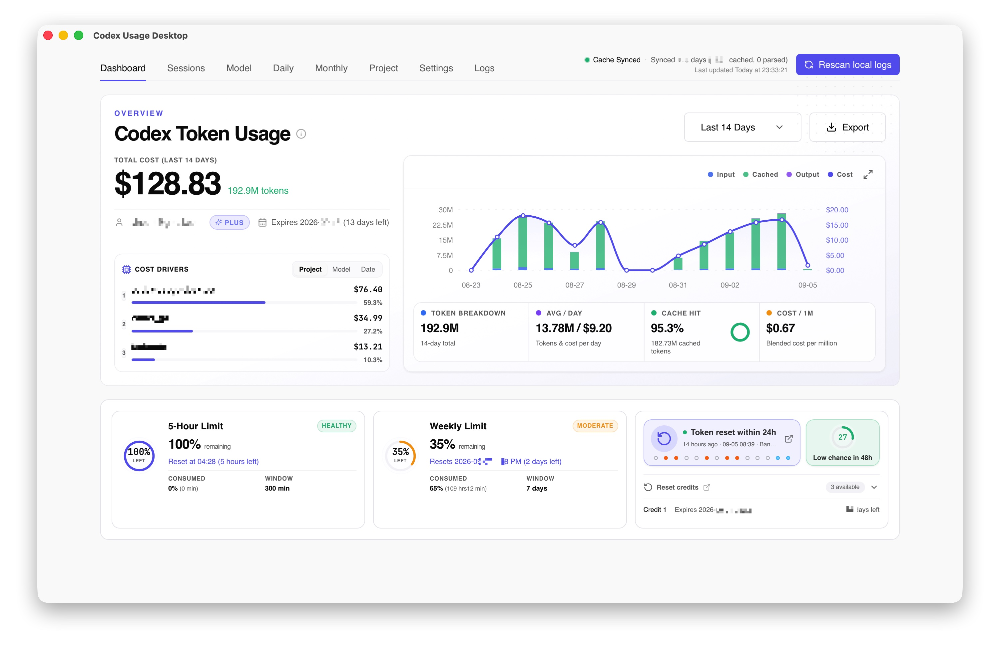
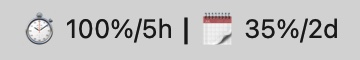
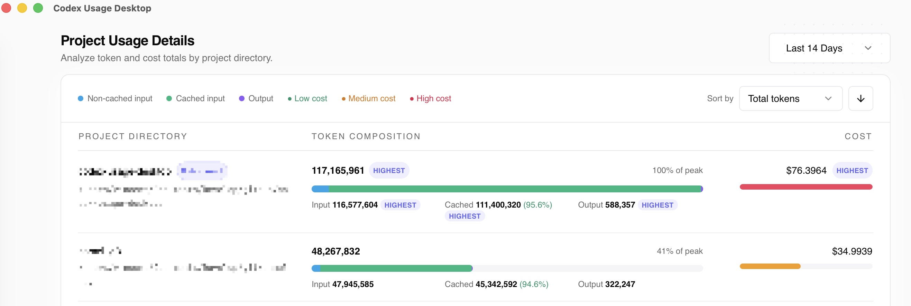
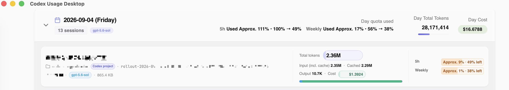
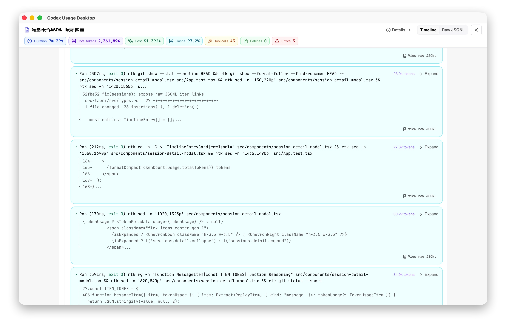

# Codex Usage Desktop

> **看清 Codex Token 用在哪裡、額度還剩多少、何時重設，一個本機桌面應用程式就能掌握。**

**[下載 Windows x64 版](https://github.com/itvincent-git/codex-usage-desktop/releases/latest/download/codex-usage-desktop-windows-x64-setup.exe)** · **[Apple 晶片版](https://github.com/itvincent-git/codex-usage-desktop/releases/latest/download/codex-usage-desktop-macos-arm64.dmg)** · **[Intel Mac 版](https://github.com/itvincent-git/codex-usage-desktop/releases/latest/download/codex-usage-desktop-macos-x64.dmg)** · [English README](README.md) · [简体中文](README_zh.md) · [日本語](README_ja.md)

⭐ 如果 Codex Usage Desktop 對你有幫助，歡迎[為專案加上 **Star**](https://github.com/itvincent-git/codex-usage-desktop)。

## 不用再猜，Codex 額度去哪了

如果你每天都在使用 Codex，你可能也想知道：

- **我的 5 小時或每週額度還剩多少？**
- **額度什麼時候重設？**
- **哪個專案或工作階段消耗了最多 Token？**
- **今天的用量和昨天相比如何？**
- **哪些模型消耗的 Token 最多、預估成本最高？**
- **每個模型消耗了多少 5 小時和每週額度？**
- **一段很長的 Codex 工作階段裡，到底發生了什麼？**

Codex Usage Desktop 將電腦上既有的 Codex 工作階段資料整理成清楚的原生儀表板，幫你回答這些問題。

**無需 API 金鑰，無需額外註冊帳號，不上傳工作階段日誌。安裝並開啟即可。**



## 你可以做什麼

### 📊 一眼看清 Codex 用量

不用翻閱 JSONL 日誌，就能了解自己的使用情況。

查看：

- Token 總量與預估成本
- 輸入、輸出和快取 Token 用量
- 快取命中率
- 每日和每月趨勢
- 每日平均用量
- 自訂日期範圍

快速判斷用量是否增加，以及 Token 都花在哪裡。

### ⏱ 在達到上限前，掌握剩餘額度

工作時隨時關注目前的 Codex 額度。

監控：

- 即時 **5 小時額度**
- **每週或每月額度**
- 剩餘額度
- 重設時間與倒數計時
- 可用重設次數
- 有資料時的額度重設預測

你還可以將額度資訊直接顯示在 **macOS 選單列或 Windows 系統匣**，自訂顯示文字和倒數計時單位，不必一直開著儀表板。

即時額度使用本機既有的 Codex 登入狀態。



### 🔍 找出 Token 消耗來源

按以下維度查看用量：

- 專案
- 模型
- 日期
- 月份
- 工作階段

看清**具體是哪個專案、模型或工作階段消耗了 Token**，了解用量背後的原因。



查看所選期間內各模型對 5 小時和每週額度的預估消耗，包括總消耗和每百萬 Token 的消耗量。這些估算來自使用單一模型的工作階段快照，可能受到同時執行的其他工作階段影響。


### 💬 深入了解個別 Codex 工作階段

從彙總圖表深入查看工作階段，了解數字背後的活動。

依標題、專案和模型搜尋工作階段，再開啟任一工作階段查看其活動。



依本機日誌中記錄的內容，工作階段畫面可以顯示：

- Token 用量與預估成本
- 5 小時和每週額度的預估消耗
- 剩餘額度變化
- 指令與工具活動
- 網頁搜尋與結果
- 修補與程式碼差異
- 長時間執行的指令
- 子代理層級
- 工作階段重播時間軸

讓你更容易同時了解 **Codex 做了什麼**，以及**這些工作消耗了多少用量**。



### 🔄 了解額度重設情況

Codex 的額度機制可能隨時間改變。Codex Usage Desktop 幫你看清這些變化。

查看：

- 最新官方 Token 重設公告
- 近期重設事件
- 過去 30 天的重設公告紀錄
- 工作階段日誌中觀察到的每日剩餘額度變化
- 有資料時的重設次數明細與到期時間

### 💻 適合日常桌面使用

Codex Usage Desktop 的設計讓你隨時掌握用量，同時減少對工作的干擾：

- 原生 macOS 與 Windows 應用程式
- macOS 選單列 / Windows 系統匣
- 登入時自動啟動
- 自動檢查更新
- English、简体中文、繁體中文和日本語
- 偵測 Windows WSL 中的 Codex 工作階段
- 淺色與深色主題

### 📤 匯出用量資料

需要在其他工具中分析或分享用量嗎？

將儀表板所選期間的資料匯出為：

- **Excel（`.xlsx`）**
- **Markdown（`.md`）**

## 預設保護隱私

你的 Codex 工作階段可能包含敏感的提示、程式碼、指令與專案資訊。

Codex Usage Desktop 將這些資料保留在你的電腦上。

- 工作階段日誌**在本機讀取**
- 應用程式**絕不上傳工作階段日誌**
- 無需 OpenAI 或 LiteLLM API 金鑰
- 無需 Codex Usage Desktop 帳號
- 彙總統計資料儲存在本機 SQLite 資料庫
- 專案**免費且開放原始碼**

你的 Codex 資料由你掌握。即時額度及其他網路請求的詳細說明，請參閱[隱私與網路存取](#隱私與網路存取)。

## 無需設定

已經在使用 Codex CLI？那就可以開始查看用量了。

1. 安裝 Codex Usage Desktop。
2. 開啟應用程式。
3. 既有的 Codex 工作階段會自動被偵測並建立索引。
4. 開始查看 Token、額度、專案、模型和工作階段。

無需部署分析伺服器，無需設定資料庫，也無需貼上 API 金鑰。

**安裝即可使用。**

## 安裝

### Windows 10/11 x64

[下載最新版 Windows 安裝執行檔](https://github.com/itvincent-git/codex-usage-desktop/releases/latest/download/codex-usage-desktop-windows-x64-setup.exe)，開啟後依安裝程式指示操作。NSIS 安裝程式僅為目前使用者安裝，無需安裝到整個系統。

> [!WARNING]
> Windows 安裝程式尚未經過 Authenticode 簽章，因此 Microsoft Defender SmartScreen 可能顯示無法辨識的應用程式警告。繼續之前，請確認檔案來自本儲存庫的 GitHub Release。

應用程式會優先使用 `%USERPROFILE%\.codex` 下的工作階段。如果該位置沒有 JSONL 工作階段，會自動檢查預設 WSL 發行版，並使用其中的 `$HOME/.codex` 資料與 Codex CLI。Windows 原生與 WSL 工作階段不會合併，以避免重複計算用量。

### macOS

選擇適合你的 Mac 的版本：

| Mac | 下載 |
| --- | --- |
| Apple 晶片（M1、M2、M3、M4 及更新型號） | [下載最新版 ARM64 DMG](https://github.com/itvincent-git/codex-usage-desktop/releases/latest/download/codex-usage-desktop-macos-arm64.dmg) |
| Intel | [下載最新版 x64 DMG](https://github.com/itvincent-git/codex-usage-desktop/releases/latest/download/codex-usage-desktop-macos-x64.dmg) |

開啟 DMG，並將 **Codex Usage Desktop** 移入「應用程式」資料夾。你也可以查看[最新版本與版本說明](https://github.com/itvincent-git/codex-usage-desktop/releases/latest)。

> [!NOTE]
> 應用程式不會繞過 macOS Gatekeeper。如果首次啟動被系統阻擋，請開啟 **系統設定 → 隱私權與安全性** 並允許開啟應用程式。

### 透過終端機安裝

安裝腳本會自動辨識 Apple 晶片或 Intel，下載對應的 DMG，並將應用程式複製到 `/Applications`：

```bash
curl -fsSL https://raw.githubusercontent.com/itvincent-git/codex-usage-desktop/main/scripts/install.sh | sh
```

腳本不會停用或繞過 Gatekeeper。

## 快速開始

1. 正常使用 Codex CLI，確保 `~/.codex`（Windows 上為 `%USERPROFILE%\.codex`）下已有工作階段日誌。
2. 開啟 Codex Usage Desktop，應用程式會掃描本機日誌並建立本機 SQLite 索引。
3. 選擇時間範圍，或開啟模型、專案、每日、每月、工作階段頁面查看用量。

查看即時帳號額度需要本機 Codex CLI 已完成驗證。如有需要，請先執行 `codex auth login`，然後重新整理儀表板。

## 隱私與網路存取

Codex 工作階段內容可能包含敏感資訊，因此應用程式的設計將資料保留在你的裝置上：

- `~/.codex` 下的來源檔案只在本機讀取，應用程式不會上傳、分享或修改這些檔案。
- 無需在應用程式中輸入或儲存 OpenAI、LiteLLM API 金鑰。
- 彙總後的用量資料儲存在作業系統應用程式資料目錄中的 SQLite 快取。
- 即時額度會使用本機既有的 Codex 驗證資訊直接向 ChatGPT 查詢，應用程式不會隨請求傳送工作階段日誌。
- 網路存取也用於公開字型檔案、模型定價、額度預測和更新檢查。定價會快取在本機，這些請求不包含工作階段日誌或用量分析資料。

## 相容性與目前限制

- 發行安裝包支援 Apple 晶片與 Intel Mac，以及 Windows 10/11 x64；目前不提供 Linux 安裝包。
- Windows 原生工作階段為空時，只檢查預設 WSL 發行版，不會合併多個發行版。
- 用量與成本根據本機 Codex 日誌計算；成本是根據可用模型定價的估算值。
- 未知模型的預估成本預設為零。
- 工作階段明細取決於每份本機 Codex 日誌中實際包含的資訊。

## 進階選項

- `CODEX_HOME`：Codex 主目錄。非空值具有最高優先權，並停用 Windows/WSL 自動偵測。
- `CODEX_CLI_PATH`：明確指定 Codex CLI 執行檔或包裝程式路徑（依平台使用 `codex`、`codex.exe` 或 `codex.cmd`）
- `CODEX_USAGE_TIMEZONE`：每日統計使用的時區，預設為系統時區，無法取得時改用 UTC

## 開發者說明

Codex Usage Desktop 使用 React 19、Vite、Tauri v2 和 Rust 原生用量處理流程建置。

安裝 Node.js `>= 24`、`pnpm`、Rust 和 Tauri v2 系統相依套件，然後啟動實際的桌面應用程式：

```bash
pnpm install
pnpm tauri dev
```

若要反覆測試 5 小時額度視窗的啟用流程而不消耗額度，請使用以下方式啟動偵錯版本：

```bash
CODEX_USAGE_DEBUG_WINDOW_ACTIVATION=1 pnpm tauri dev
```

在此模式中，檢查額度會還原模擬的未啟用視窗，啟動視窗則會回傳模擬的成功啟用結果。正式發行版本會忽略此開關。

執行檢查：

```bash
pnpm test
pnpm typecheck
cd src-tauri && cargo test
```

使用 `pnpm tauri build` 建置安裝包。

### 查看 Release 下載趨勢

執行 `pnpm downloads:trend`，腳本會讀取 GitHub Releases 中三個安裝包的累計下載次數，並將快照儲存在儲存庫根目錄的 `.release-downloads.json`。定期執行即可查看快照之間的下載增量。首次執行只建立基準，無法還原先前的每日下載量。需要更高的 GitHub API 請求額度時，可設定 `GITHUB_TOKEN` 或 `GH_TOKEN`。

這些數字是下載次數，而非安裝人數。Windows 安裝包也用於應用程式更新，因此下載次數包含更新。

## Star 歷史

<a href="https://www.star-history.com/?repos=itvincent-git%2Fcodex-usage-desktop&type=date&legend=top-left">
 <picture>
   <source media="(prefers-color-scheme: dark)" srcset="https://api.star-history.com/chart?repos=itvincent-git/codex-usage-desktop&type=date&theme=dark&legend=top-left" />
   <source media="(prefers-color-scheme: light)" srcset="https://api.star-history.com/chart?repos=itvincent-git/codex-usage-desktop&type=date&legend=top-left" />
   
 </picture>
</a>
